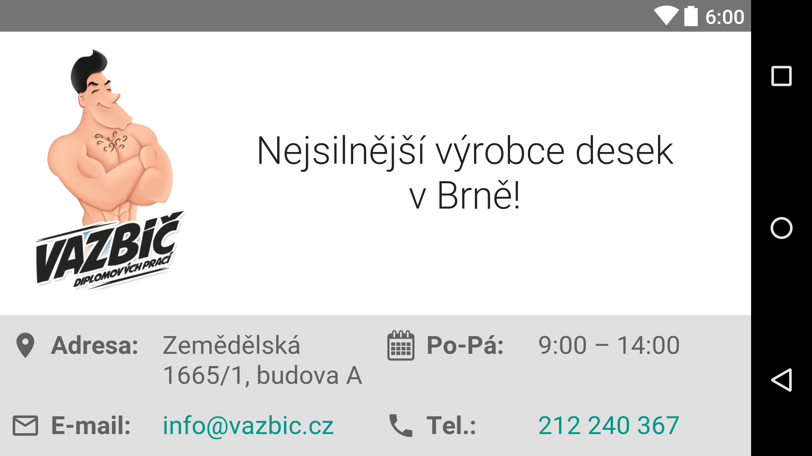

# UdacityAndroidProjects

## One Screen App

## Court Counter App

I made a counter for tennis match. A match has at most three sets. A team wins when they won two sets. Activity state remains while the screen is rotated. A player is noticed when he resets the match (presses NEW GAME button).

TODO:

- print tiebreak score along with games in the table

