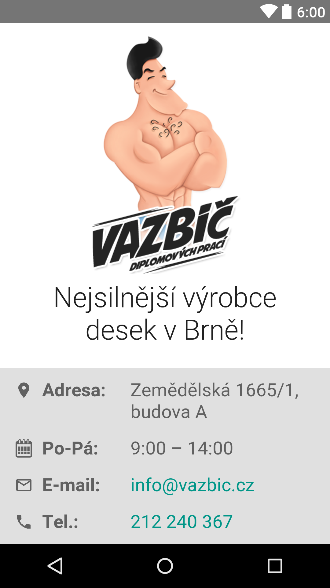
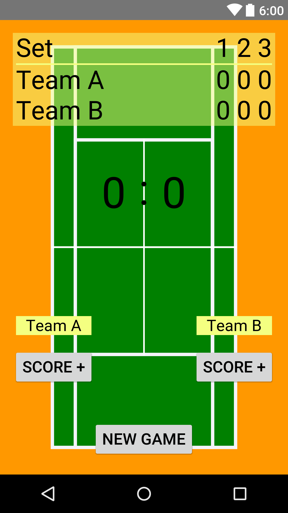
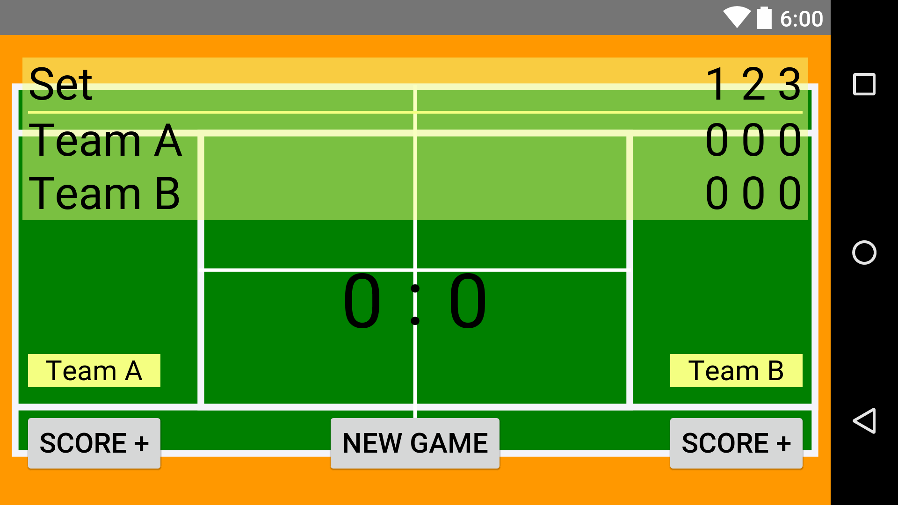

# UdacityAndroidProjects

## One Screen App

## Court Counter App

I made a counter for tennis match. Some features are not implemented yet (tie-break, a match always has 3 sets, a better landscape mode).

